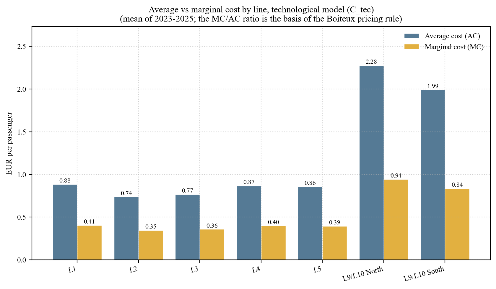

# Barcelona Metro Cost Analysis

**How much does it really cost to run the Barcelona metro — line by line — and why fare revenue can never cover it.**

<p align="center">
  
</p>

The Barcelona metro carries ~440 million trips a year across 7 lines. Public budgets keep growing and the political debate is loud: are fares too low, is the system bloated, are the automated lines (L9/L10) overpriced? This project estimates the actual cost structure line-by-line and gives a quantitative answer to those questions, using only public TMB data.

## Headline result

Marginal cost is **less than half** of average cost (€0.42 vs €0.91 per passenger). That means **no realistic fare can cover total cost** — a structural subsidy of around **54%** is mathematically optimal, not a policy choice. The result holds across six independent robustness tests.

## Why this is non-obvious

Public-transport cost analysis usually stops at the system level ("the metro costs X per year"). That hides three things this project recovers:

- **Returns to density.** Every extra passenger costs roughly half of the average — the metro is a textbook case of decreasing average cost.
- **The L9/L10 problem.** Automated lines look much more expensive (€6.88 vs €0.94 per passenger). The estimation separates the technological cost from the institutional charge (`canon Ifercat`) and shows the gap is mostly the second one.
- **The Boiteux benchmark.** Once marginal and average cost diverge this much, optimal pricing theory gives a precise subsidy number — not "high" but **54%**. Useful for budget debates.

## How it works

A multi-output translog cost function calibrated on a line-year panel (7 lines × 3 years, 2023–2025), using passenger-km and train-km as outputs and labour and energy as input prices. Two specifications are compared (operating-only vs. full-cost) and six robustness scenarios test every assumption.

## Stack

Python · pandas · numpy · matplotlib · LaTeX

## Run it

```bash
pip install pandas numpy openpyxl matplotlib
python scripts/01_build_panel.py
python scripts/02_calibrate_translog.py
python scripts/03_robustness.py
python scripts/04_make_figures.py
```

## More

- **Paper (~19 pp)**: [`paper/paper_translog_fmb.tex`](paper/paper_translog_fmb.tex)
- **All figures**: [`outputs/figures/`](outputs/figures/)
- **Result tables (CSV)**: [`outputs/tables/`](outputs/tables/)
